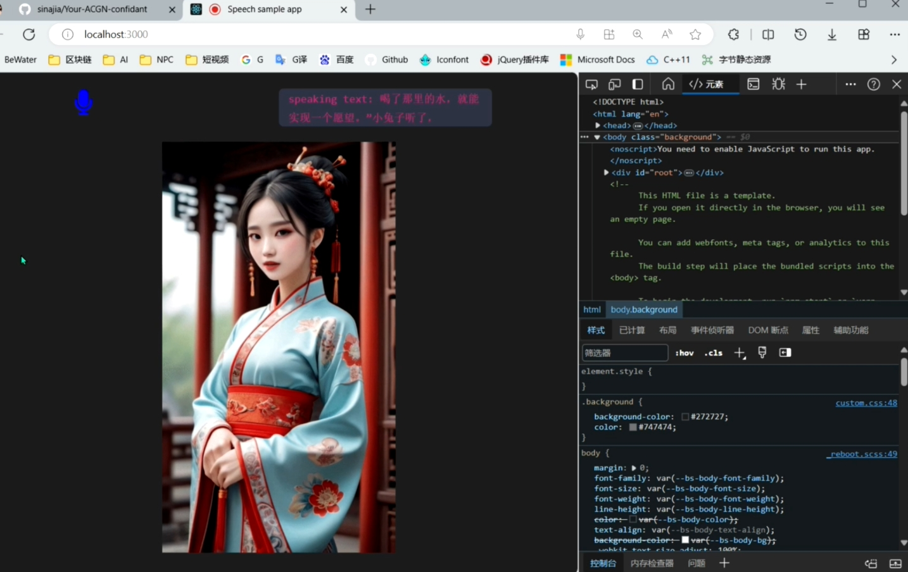

# Quickstart

Chat in real time with virtual characters

<video src="https://github.com/sinajia/Your-ACGN-confidant/assets/7146748/1151ef88-f02f-4e2c-be95-fa325cac3a93" width="100" controls preload></video>

## Prepare environment

- "node": ">=18"
- "pnpm": ">=8"
- Azure speech Service key && (OpenAi key || AlibabaTongyi key)

## Start up

1. cp env-sample.txt .env

2. Configure .env file

3. pnpm install

4. pnpm dev
